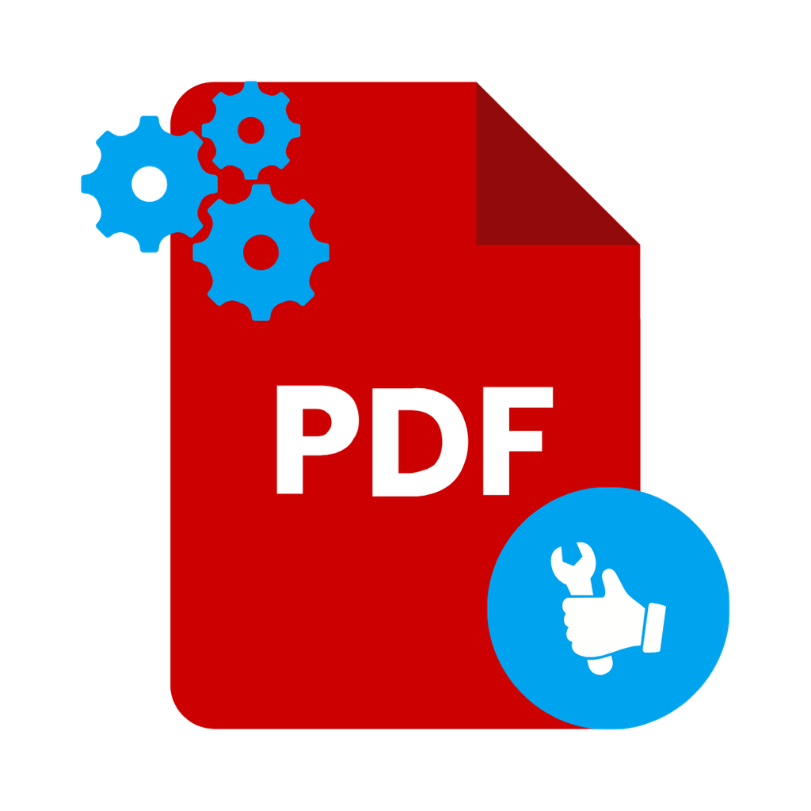

# PDFix



A desktop app for everyday PDF work: merge, split, extract, rotate, watermark,
number, describe, shrink — and convert to PDF/A for long-term archiving.

Everything happens on your computer. No file is ever uploaded anywhere, no
account is needed, and the installed app needs no runtime, interpreter or extra
library: you install it, you open it, it works.

<br clear="left" />

Available for **Windows**, **macOS** (Intel and Apple Silicon) and **Linux**
(`.deb`, AppImage and Snap), in **English** and **Italian**.

---

## What it can do

| Feature | What it does |
|---|---|
| **Merge PDFs** | Joins several documents into one, in the order you choose — drag the rows to reorder. |
| **Convert to PDF/A** | Rewrites a document as PDF/A-1b, the format archives ask for. |
| **Extract pages** | Keeps only the pages you list (`1-3,7`), in the order you list them. |
| **Delete pages** | Removes the pages you list and keeps everything else. |
| **Rotate pages** | Turns selected pages by 90°, 180° or 270°. |
| **Split PDF** | Produces one file per page, or one file per range, into a folder you pick. |
| **Pages per sheet** | Puts two or four pages on every sheet, so printing uses less paper. |
| **Booklet** | Imposes the document for saddle stitching: print double-sided on the short edge, fold in half. |
| **Uniform page size** | Brings mixed A4, A5 and scan sizes to one format, scaled and centred, never distorted. |
| **Trim margins** | Narrows the visible area of the pages — handy on crooked scans and black borders. |
| **Images to PDF** | Turns JPG and PNG files into a document, one image per page, at original size or fitted to A4. |
| **Watermark** | Lays a diagonal text over every page — size, opacity and angle are yours to set. |
| **Image watermark** | Places your logo or stamp over the pages you choose, at the position, size and opacity you set. |
| **Page numbers** | Prints page numbers in any of six positions, optionally as “3 / 12”. |
| **Bates numbering** | Numbers a whole bundle with one continuous sequence that carries on from file to file, as legal work requires. |
| **Read form fields** | Lists the fillable fields of a form and saves them as a JSON file. |
| **Fill in the form** | Asks for a value for every field the document actually has, then writes them in. |
| **Lock the form** | Turns filled fields into fixed content: the document looks the same and can no longer be edited. |
| **Edit metadata** | Sets title, author, subject and keywords. |
| **Attach a file** | Embeds a file — an XML invoice, a spreadsheet — and writes the result as PDF/A-3b, the format compliant archiving asks for. |
| **Create bookmarks** | Builds the navigable outline from a list of pages and titles. |
| **Split at bookmarks** | One file per top-level bookmark, each named after the bookmark. |
| **Protect with a password** | Encrypts the document with AES-256 and sets what a reader may print, copy or change. |
| **Remove the protection** | Produces an unencrypted copy, given the password. |
| **Signature on the page** | Places your scanned signature — a PNG or a JPG — on the page: drag it onto the live preview of the document, resize it, pick the page. |
| **Optimise** | Repacks the document to make it smaller, without touching the pages. |

**Trim margins is framing, not redaction.** The content outside the visible area
stays in the file and can still be extracted — use it to tidy a scan, never to
hide anything.

**A password you forget cannot be recovered.** PDFix encrypts with AES-256 and
keeps nothing: without the password the document is gone. Write it down before
you close the dialog.

**A signature on the page is not a digital signature.** It is the image of your
handwriting, placed where you would sign on paper: it proves nothing
cryptographically, and any reader can see it is a picture. Certificate-based
PAdES signing is not available in this version.

**The preview never leaves the computer.** The page you drag the signature onto
is rendered locally, in the application window, like every other operation.

The PDF/A switch also applies to merging: combine several documents and get a
PDF/A-1b file straight away.

> **A note on PDF/A.** PDFix writes everything the standard asks of the document
> itself: the `%PDF-1.4` header, a file identifier, an output intent with an
> embedded sRGB colour profile and the XMP metadata that declares conformance.
> Fonts and images come from your original file as they are — if the original
> does not embed its fonts, no tool can make it conformant by rewriting
> metadata.

---

## Installing

| System | File | How |
|---|---|---|
| Windows | `pdfix_vX.Y.Z_x64.exe` | Portable: run it, no installation. Nothing is written outside the app folder and `%TEMP%`. |
| macOS | `pdfix_vX.Y.Z_arm64.dmg` / `_x64.dmg` | Open the disk image and drag PDFix into Applications. |
| Debian / Ubuntu | `pdfix_vX.Y.Z_amd64.deb` | `sudo apt install ./pdfix_vX.Y.Z_amd64.deb` |
| Snap | `pdfix_vX.Y.Z_amd64.snap` | `sudo snap install --dangerous ./pdfix_vX.Y.Z_amd64.snap` |
| Any Linux | `pdfix_vX.Y.Z_x86_64.AppImage` | `chmod +x`, then run it. |

---

## Using it

When you launch PDFix a small logo window appears for a moment: the app is
warming up its engine, and the main window opens as soon as everything is ready.

1. **Add files** — click the drop area, drag files onto it, or press
   <kbd>Ctrl</kbd>/<kbd>Cmd</kbd>+<kbd>O</kbd>.
2. **Put them in order** — drag the handle on the left of each row. Remove a
   file with the ✕, or empty the list.
3. **Pick a command** — only the commands that fit what you loaded stay
   enabled; hover a disabled one to read why.
4. **Set the details** — commands that need them (page ranges, angle, watermark
   text…) ask in a small window first.
5. **Choose where to save** — a normal save dialog; splitting asks for a folder
   instead.

The result is written straight to disk and the app tells you how many pages it
produced and how big the file is.

---

## Settings

Open them with the gear button or <kbd>Ctrl</kbd>/<kbd>Cmd</kbd>+<kbd>,</kbd>.

| Setting | What it changes |
|---|---|
| **Language** | English or Italian, for the whole app and its system dialogs. You can also switch it from the dropdown in the title bar. |
| **Theme** | Light, dark, or follow the system. |
| **Interface zoom** | 10% to 150% — useful on very small screens and on very dense ones. |
| **Memory limit** | How much memory the processing may use. Automatic by default (half your RAM); raise it for very large documents. |
| **Processing timeout** | How long a job may run before it is stopped. |
| **PDF/A by default** | Pre-selects PDF/A conversion at startup. |
| **Remember last folder** | Open and save dialogs start where you left off. |
| **Features** | Switch off the commands you never use: they disappear from the toolbar. |

“Measure real limit” runs a real processing job and reports the memory ceiling
actually in force — handy when a big document fails and you want to know
whether raising the limit will help.

The window works from 800×600 up to 4K, and your settings are remembered
between sessions.

---

## Help and bug reports

The **i** button in the title bar shows the version, the author and the
licence — and a **Report a bug** button that opens your mail app with the
subject already filled in and the version details of your installation in the
message, so a report takes one click and a description.

The same window has a **Donate** button that opens the project's PayPal page in
your browser. Donating is entirely optional: PDFix is free software under the
AGPLv3 and every feature works the same either way.

---

## Privacy

PDFix opens files you point it at, writes the file you ask for, and nothing
else. It makes no network connections, collects no telemetry and stores nothing
beyond your own preferences (a single JSON file in your user profile).

---

## Building from source

```bash
npm install
npm start            # build and run
npm run dev          # development, with hot reload
npm test             # interface, engine and end-to-end suites
```

Requirements: Node.js 20.19+ and npm 9+. Packaging for Linux additionally uses
`fakeroot`, `dpkg-dev` and `squashfs-tools`.

```bash
npm run dist         # packages for the current platform
npm run dist:linux   # .deb + AppImage + Snap
npm run dist:win     # Windows portable executable
npm run dist:mac     # macOS disk image (macOS only)
```

Packages come out in `release/`.

---

## Licence

GNU Affero General Public License v3.0 or later.
Copyright © 2026 Lorenzo De Marco.
